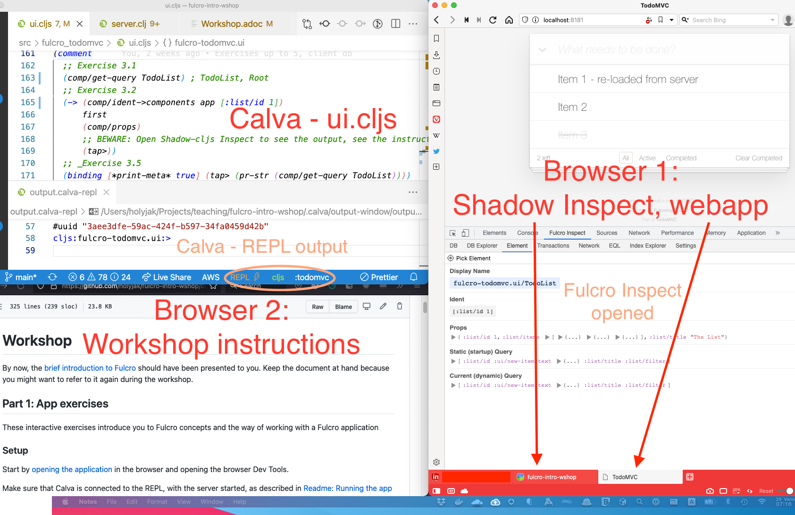
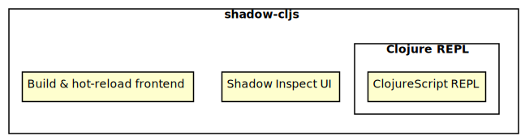

Workshop: Introduction to creating webapps with Fulcro
======================================================

<table><tr>
<td style="font-size: 4rem">⚠️</td>
<td>You must <strong><a href="#prerequisites">install prerequisites</a> and have the <a href="#running-the-app-from-vs-code-with-calva">app running</a> BEFORE</strong> the workshop!</td>
</tr></table>

An online workshop held as a part of [re:Clojure 2021](https://www.reclojure.org/) on December 1st, 3-5pm GMT. See the [workshop Eventbrite page](https://www.eventbrite.com/e/reclojure-introduction-to-fulcro-workshop-tickets-188718210247) for details and registration.

*Get your hands dirty with Fulcro to experience and "get" this unique, full-stack web framework for Clojure*

Fulcro is unique among Clojure web frameworks in providing a complete, integrated, full-stack solution for creating non-trivial web applications. It is based on a few simple ideas with far-reaching consequences, it is unusually malleable, and we love it for its focus on creating maintainable, developer-friendly code.

In this workshop you will get a brief introduction to Fulcro and then get your hands dirty exploring the concepts in practice on an existing application in a series of guided exercises. We will use the excellent Fulcro Inspect tooling and mess up with the code.

Prerequisites
--------------

### Theoretical

There are no "hard" theoretical prerequisites other than general experience with Clojure development but it will help a lot if you:

* (Preferably) have an experience with ClojureScript
* Have an idea about how React works
* Have an idea about GraphQL

### Practical

To do right now:

* Clone / download this repository to a directory on your computer
* Install Java, [Clojure CLI tools](https://clojure.org/guides/getting_started), [Node and npm](https://nodejs.org/en/)
* In a Chromium browser such as Vivaldi or Chrome:
  * Install [Fulcro Inspect](https://chrome.google.com/webstore/detail/fulcro-inspect/meeijplnfjcihnhkpanepcaffklobaal)
  * Install [React Developer Tools](https://chrome.google.com/webstore/detail/react-developer-tools/fmkadmapgofadopljbjfkapdkoienihi)
  * Restart the browser after you install the two plugins
  * Configure [Chrome Development Settings](https://developers.google.com/web/tools/chrome-devtools/customize): 
    * Under "Console": "Enable Custom Formatters"
    * Under "Network": "Disable Cache (while devtools is open)"
* (Optional, recommended) Install VS Code with Calva
* Try to [run the application](#running-the-app-from-vs-code-with-calva) and connect to its REPL as described below

An hour or so before the workshop:

* Have the [application running](#running-the-app-from-vs-code-with-calva) as described below. Make sure you can see the To Do application in the browser. If not, follow the _Troubleshooting_ instructions below. Open Dev Tools and verify that _Fulcro Inspect_ is there.
* Set up your windows as described in the [workshop instructions](https://github.com/holyjak/fulcro-intro-wshop/blob/main/docs/Workshop.adoc#setup) and have both these workshop and [Fulcro intro](https://github.com/holyjak/fulcro-intro-wshop/blob/main/docs/INTRO.md) opened in a browser tab:



Usage
-----

### Running the app from VS Code with Calva

To make everyone's lives simpler, it is _recommended_ that use use VS Code with [Calva](https://calva.io/), no matter what is your preferred editor / IDE. You only [need to know a few Calva keybindings](https://github.com/holyjak/interactive-dev-wshop/blob/master/Cheatsheet.md#vs-code-and-calva-shortcuts) to be sufficiently effective during the workshop.

(You can use your editor if you really prefer that but you are on your own if you run into any problems with that.)

To run the application using Calva:

* Make sure Node dependencies are installed. In the terminal, run `npm install` (or use yarn)
* In the menu _View - Command Palette... - [Calva: Start a Project REPL and Connect (aka Jack-In)](https://calva.io/connect/)_
* Select _shadow-cljs_
* Select `:todomvc` for the aliases to launch with (Note that it is not enough to press `enter` on the item, you need to first press `space` or click the checkbox.)
* Wait a few seconds, then select `:todomvc` for the build to connect to
* Once you see the message `[:todomvc] Build completed.` in the Calva Jack-in terminal:
    1. Open the file `src/fulcro_todomvc/server.clj` (_Go_ - _Go to File..._)
    1. Load the file by executing the command _Calva: Load current Current File and Dependencies_
    1. Scroll down to the `(comment ...)` form and place the cursor in `(http-server)`, then press `alt+enter`
       * This will evaluate the form (call the `http-server` function)
       * The web browser will open with your application

### Running the app from the terminal

You can start the app, both the frontend build and the backend server, from the terminal, as described below. But it is preferable to use VS Code with Calva and start them from Calva, which will provide you with better code inspection capabilities.

```bash
# In a terminal (preferable: use Calva):
❯ npm install # or yarn install
❯ npx shadow-cljs watch todomvc

# In another terminal:
❯ clj -A:dev
Clojure 1.10.3
user=> ((requiring-resolve 'fulcro-todomvc.server/http-server))
```

Connect you editor to the browser REPL. In Calva, execute _Calva: Connect to a Running REPL Server in the Project_ - select shadow-cljs - accept the default localhost:9000.

Shadow-cljs runs a number of things:



#### Relevant ports

* 8181 the webapp, served by our server (see `server.clj`)
* 9000 shadow-cljs nREPL
* 9630 shadow-cljs UI including its Inspect

### Using Cursive, Emacs, etc.

It is possible to participate using any IDE but I really **_implore you_** to bite the bullet and use Calva this one time (though I am normally Cursive user myself). I do not have the bandwidth to support people that run into issues with any other setup and inevitably the do, even though they are otherwise experts in their IDE of choice. You will not do anything fancy in the editor - you only need a single keybinding to eval a form (alt-enter) and the biggest editing you will do is changing one keyword to another.

### Troubleshooting problems with running the application

* If the application does not work properly when you start it from Calva then try to start it manually from the terminal, as described above.
* Are there any errors from shadow-cljs? Look both in the Calva Jack-in _Terminal_ at the bottom of VS Code (if you have closed it: _View - Open View..._ - type `terminal` - you should see 3, where the third is the one you want, "1.1 Calva Jack-in: shadow-cljs") There is lot of output, including the following lines:

```
npx shadow-cljs -d cider/cider-nrepl:0.26.0 watch :todomvc
shadow-cljs - config: /some/path/to/fulcro-intro-wshop/shadow-cljs.edn
shadow-cljs - starting via "clojure"
[..]
shadow-cljs - server version: 2.15.5 running at http://localhost:9630
shadow-cljs - nREPL server started on port 9000
shadow-cljs - watching build :todomvc
[:todomvc] Configuring build.
[:todomvc] Compiling ...
[..]
[:todomvc] Build completed. (260 files, 0 compiled, 0 warnings, 11.01s)
```

* Look also into `output.calva-repl` for any problems. (You can re-open it by running _Go - Go to File..._ - type `output.calva-repl`)
