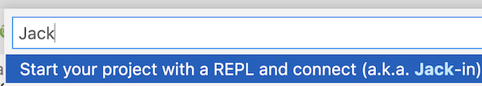

Workshop: Web development from the future / Introduction to creating webapps with Fulcro
========================================================================================

<table><tr>
<td style="font-size: 4rem">⚠️</td>
<td>You must <strong><a href="#prerequisites">install prerequisites</a> and have the <a href="#running-the-app-from-vs-code-with-calva">app running</a> BEFORE</strong> the workshop!</td>
</tr></table>

*A self-paced or facilitated workshop that enables you to get your hands dirty with Fulcro to experience and "get" this unique, full-stack web framework. Originally presented at [re:Clojure 2021](https://www.reclojure.org/).*

**For non-Clojure developers**: Experience the lessons the Clojure community has learned about sustainable and productive development of real-world, full-stack web applications. See the dev productivity boost provided by locality, navigability, and excellent dev tooling, the value of a graph API, of a normalised data cache. You may never use Clojure but these lessons will stay with you. This workshop brings ideas from the Fulcro web framework to the wider public. You will learn about the ideas behind Fulcro and get to interact with a Fulcro web app using its excellent developer tooling to see how these ideas work in practice. No knowledge of Clojure required.

**For Clojure developers**: Fulcro is unique among Clojure web frameworks in providing a complete, integrated, full-stack solution for creating non-trivial web applications. It is based on a few simple ideas with far-reaching consequences, it is unusually malleable, and we love it for its focus on creating maintainable, developer-friendly code.

In this workshop you will get a brief introduction to Fulcro and then get your hands dirty exploring the concepts in practice on an existing application in a series of guided exercises. We will use the excellent Fulcro Inspect tooling and mess up with the code.

There are two slight variations of this workshop, depending on whether you have previous experience with Clojure or not. The text below caters primarily to the Clojure-experienced crowd and some parts might be simplified / jumped over for non-Clojure audiences.

You can find the workshop materials [here](docs), including:

* [Course introduction](docs/INTRO.md)
* [Instructor's manual](docs/Instructor_manual.adoc)
* [Student exercises](docs/Workshop.adoc)

Doing the workshop: self-paced or facilitated
---------------------------------------------

You can do this workshop **on your own** - perform the setup linked above, [watch the minimalist introduction to Fulcro](https://youtu.be/UrpYLyGy4Lc), and then [follow the instructions and do the exercises](docs/Workshop.adoc). If you run into any issues or need help, use this repository's [discussions](discussions) or [issues](issues) and/or reach out to `@holyjak` in the [Clojurians Slack](http://clojurians.net/). I am also making a video of me doing the exercises, accompanied by a commentary, which will be available for $10 (to cover some of the costs of making this workshop) - [get in touch](blog.jakubholy.net/contact/) if you are interested.

**I can also facilitate this workshop** for you or your company, see [my business site for details](https://holyjak.cz/holy-dev.html) and [get in touch](blog.jakubholy.net/contact/).

Prerequisites
--------------

### Theoretical

There are no "hard" theoretical prerequisites other than general experience with web development (ideally in Clojure) but it will help a lot if you:

* (Preferably) have an experience with ClojureScript
* Have an idea about how React works
* Have an idea about GraphQL

### Practical

To do right now:

* Clone / download this repository to a directory on your computer
* Install Java, [Clojure CLI tools](https://clojure.org/guides/install_clojure), [Node and npm](https://nodejs.org/en/) (_NOTE: You can skip this step and run instead everything in a virtual machine provided by GitPod, see the [GitPod instructions below](#running-the-app-with-in-browser-vs-code-and-backend-via-gitpod-experimental)._)
* In a Chromium browser such as Vivaldi or Chrome:
  * Install [Fulcro Inspect](https://chrome.google.com/webstore/detail/fulcro-inspect/meeijplnfjcihnhkpanepcaffklobaal)
  * Install [React Developer Tools](https://chrome.google.com/webstore/detail/react-developer-tools/fmkadmapgofadopljbjfkapdkoienihi)
  * Restart the browser after you install the two plugins
  * Configure [Chrome Development Settings](https://developers.google.com/web/tools/chrome-devtools/customize):
    * Under "Console": "Enable Custom Formatters"
    * Under "Network": "Disable Cache (while devtools is open)"
* (Optional, recommended) Install VS Code with Calva
* Try to [run the application](#running-the-app-from-vs-code-with-calva) and connect to its REPL as described below

An hour or so before the workshop:

* Have the [application running](#running-the-app-from-vs-code-with-calva) as described below. Make sure you can see the To Do application in the browser. If not, follow the _Troubleshooting_ instructions below. Open Dev Tools and verify that _Fulcro Inspect_ is there.
* Set up your windows as described in the [workshop instructions](https://github.com/holyjak/fulcro-intro-wshop/blob/main/docs/Workshop.adoc#setup) and have both these workshop instructions and the [Fulcro intro](https://github.com/holyjak/fulcro-intro-wshop/blob/main/docs/INTRO.md) opened in two tabs of a browser window:


Usage
-----

### Running the app from VS Code with Calva

#### Alternative 1: Using a local desktop VS Code

To make everyone's lives simpler, it is _recommended_ that you use VS Code with [Calva](https://calva.io/), no matter what is your preferred editor / IDE. You only [need to know a few Calva keybindings](https://github.com/holyjak/interactive-dev-wshop/blob/master/Cheatsheet.md#vs-code-and-calva-shortcuts) to be sufficiently effective during the workshop.

(You can use your editor if you really prefer that but you are on your own if you run into any problems with that.)

Provided that you have Calva installed, you are ready to go. Read "Starting the app below".

#### Alternative 2: Using an in-browser VS Code and backend via Gitpod

It is preferable to run the app locally with Calva (see below) but if you run into some issues with the editor or tooling, you can run everything in the browser with a pre-configured virtual machine:

[](https://gitpod.io/from-referrer/)

(Requires login via GitHub / GitLab / Bitbucket. Gitpod offers enough free usage time for this workshop.)

#### Starting the app from VS Code (desktop/remote)

To run the application using Calva:

* [Desktop]: Run `npm install` (or use yarn) in a terminal to make sure Node dependencies are installed. [_Not needed in GitPod_]
* Connect to the runtime:
  1. In the menu (in Gitpod it is the ☰ in the top-left corner) select _View - Command Palette... - [Calva: Start a Project REPL and Connect (aka Jack-In)](https://calva.io/connect/)_ 
    * Note: This _should_ also start the backend server and open the frontend app in a browser - but it will take a while before its compilation is finished so you will need to refresh the browser.
* Give it a while to finish the startup sequence
* [If necessary] Start the server & open the page (if it did not start automatically, which it fails to do in Gitpod): open the file `src/fulcro_todomvc/server.clj`, Command Palette - _Load/Evaluate Current File and its Requires/Dependencies_, then place your cursor at the line `(http-server)` close to the end of the file and press `Alt-Enter` (or execute _Calva: Evaluate Top Level Form_)
* NOTE: Browser with the app should open automatically. If it shows "stale output" for too long, reload the app in there.

NOTE to Clojure devs: The Jack-in starts the shadow-cljs build `:todomvc` and also loads and starts the server thanks to a [custom Calva connect sequence](https://calva.io/connect-sequences/) defined here in [settings.json](.vscode/settings.json).
  
### Alternative 1 to VS Code: Running the app from the terminal

You can start the app, both the frontend build and the backend server, from the terminal, as described below. But it is preferable to use VS Code with Calva and start them from Calva, which will provide you with better code inspection capabilities.

```bash
# In a terminal (preferable: use Calva):
❯ npm install # or yarn install
❯ npx shadow-cljs watch todomvc

# In another terminal:
❯ clj -A:dev
Clojure 1.10.3
user=> ((requiring-resolve 'fulcro-todomvc.server/http-server))
```

Connect your editor to the browser REPL. In Calva, execute _Calva: Connect to a Running REPL Server in the Project_ - select shadow-cljs - accept the default localhost:9000.

Shadow-cljs runs a number of things:


#### Relevant ports

* 8181 the webapp, served by our server (see `server.clj`)
* 9000 shadow-cljs nREPL
* 9630 shadow-cljs UI including its Inspect

### Alternative 2: Using Cursive, Emacs, etc.

It is possible to participate using any IDE but I really **_implore you_** to bite the bullet and use Calva this one time (though I am normally Cursive user myself). I do not have the bandwidth to support people that run into issues with any other setup and inevitably the do, even though they are otherwise experts in their IDE of choice. You will not do anything fancy in the editor - you only need a single keybinding to eval a form (alt-enter) and the biggest editing you will do is changing one keyword to another.

### Troubleshooting 

#### Troubleshooting problems with running the application

* If the application does not work properly when you start it from Calva then try to start it manually from the terminal, as described above.
* Are there any errors from shadow-cljs? Look both in the Calva Jack-in _Terminal_ at the bottom of VS Code (if you have closed it: _View - Open View..._ - type `terminal` - you should see 3, where the third is the one you want, "1.1 Calva Jack-in: shadow-cljs") There is lot of output, including the following lines:

```
npx shadow-cljs -d cider/cider-nrepl:0.26.0 watch :todomvc
shadow-cljs - config: /some/path/to/fulcro-intro-wshop/shadow-cljs.edn
shadow-cljs - starting via "clojure"
[..]
shadow-cljs - server version: 2.15.5 running at http://localhost:9630
shadow-cljs - nREPL server started on port 9000
shadow-cljs - watching build :todomvc
[:todomvc] Configuring build.
[:todomvc] Compiling ...
[..]
[:todomvc] Build completed. (260 files, 0 compiled, 0 warnings, 11.01s)
```

* Look also into `output.calva-repl` for any problems. (You can re-open it by running _Go - Go to File..._ - type `output.calva-repl`)
* Make sure that you actually use the `shadow-cljs` version declared in `package.json` (and not e.g. your older. global installation)
* Make sure that your Node version is compatible with the one in `package.json - engines`

#### Troubleshooting other problems

* Fulcro Inspect is just a blank page - try a different Chromium-based browser (Chrome, Vivaldi). Right-click - Inspect inside Fulcro Inspect to look for errors in its Console. It can fail e.g. if it is not allowed to access `localStorage`.
