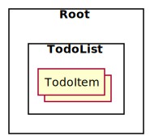
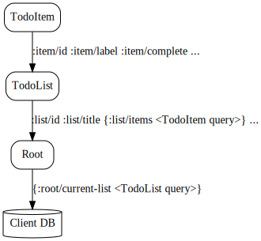
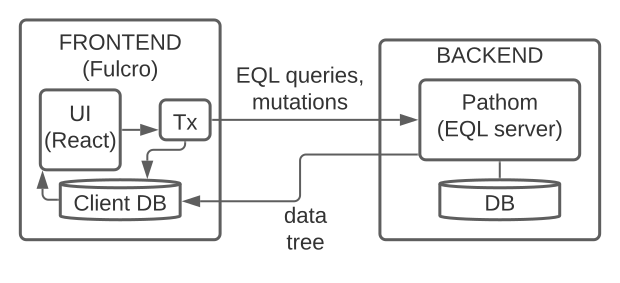

# Exercises

Start by opening the application in the browser and opening the browser Dev Tools.

TIP: It might be easier to read this rendered, for example by looking at in the browser: https://github.com/holyjak/fulcro-intro-wshop/blob/main/docs/Exercises.adoc

Note: You have about 5 - 10 minutes per exercise.

## Introductory exercises

### 1. Component tree

1. Open the React dev tools' **Components tab**
2. Explore the tree of the components displayed
3. Select one of the `TodoItem` elements - can you see its props on the right side (or at the bottom, on a smaller screen)? (Answer: yes and no :-))

We see that the components are nested in each other, creating a tree (with a single "branch" in this case):

.UI components tree


The following code is a simplified version of the code defining the UI:

.UI code (simplified):
```clojure
(defsc TodoItem [_ props]
  {...}
  (dom/li (:item/label props)))

(defsc TodoList [_ props]
  {...}
  (dom/ul 
    (map #((com/factory TodoItem) %) 
         (:list/items props))))

(defsc Root [_ props]
  {...}
  (dom/div ((comp/factory TodoList) (:root/todo props))))
```

LESSON: The UI is indeed a tree of components: `Root > TodoList > TodoItem`.

### 2. Component props and query

React dev tools cannot show us the props of the component because it is a ClojureScript data structure. Let's have a look at them using Fulcro Inspect!

1. Open now the **Fulcro Inspect** tab and its **Element** sub-tab.
2. Click the _Pick Element_ in the top left corner and then click "Item 1" in the webapp
3. You should now see the details of the TodoItem, including
  * its "_ident_", meaning "identifier", namely `[:item/id 1]`
  * its _props_, including `:item/complete` and `:item/label`
    (click the ▶ to expand them)
  * its _query_ - notice how the props mostly mirror the query
4. Mark "Item 1" as complete by clicking to the left of its label and change its text by double-clicking on it and typing something then clicking outside of the list. How have the props changed? +
_Beware_: You might need to _Pick Element_ again to see the changes
  * Notice that for most purposes, having a prop with the value `false` and not having the prop at all are equivalent
5. _Pick_ another list item element and compare its values with the original item
6. Select the whole `TodoList` and look at its ident, props, and query

LESSON: We have learned to use _Fulcro Inspect - Element_ to explore a component and we have learned that it has props, ident, and a query. We saw that the props mirror what is specified in the query.

### 3. Exploring the query

The query of a component declares its data needs and Fulcro uses it to build the props for the component. We have seen it using Fulcro Inspect - Element, now we will explore it using the REPL.

1. Open `src/fulcro_todomvc/ui.cljs`, scroll to the bottom and inside the `(comment ...)` find _Exercise 3.1_ and evaluate the `get-query` call, read the result
+
NOTE: The evaluation result is displayed both inline and inside the `output.calva-repl` file (_Go - Go to File..._ to reopen it)

2. Now let's look at what the props look like - at the same place, under _Exercise 3.2_, eval the `(-> ... (comp/props) ..))` form. 
   _Note_: We used `tap>` so the data will not show up in the REPL but in a tap client. So open the http://localhost:9630/inspect-latest[Shadow-cljs Inspect Latest] in a new tab of the same browser and eval the form again. The value should appear in the Shadow Inspect; at the very bottom, **click _Pretty-Print_** to make it readable.
Compare the props and the query (and notice it is the same thing we saw in the Element tab)
3. Repeat for `TodoList` (remember you can find its ident using the Element tab)
+
We see that `TodoList` queries for these props (some omitted): `[:list/id :list/items :list/title :list/filter]`.
+
But it also elaborates what it wants for each of the `:list/items` elements, namely `[:item/id :item/label :item/complete ...]`. How does it do that? By combining the two using a map, to produce a so called "join":
+
```clojure
#{:list/items [:item/id :item/label :item/complete :ui/editing :ui/edit-text]}
```
+
and includes this in its query instead of just `:list/items`. Let's visualize how the query composes all the way to the Root:
+
.Query composition

+
Now https://github.com/holyjak/fulcro-intro-wshop/blob/4992e994cb51bef46d6aaca5f7515da9c9536fb0/src/fulcro_todomvc/ui.cljs#L123[look at the code] to see how the child's query is included - it is not simply pasted in the parent, it is included via `(comp/get-query TodoItem)`. This is important because it brings with it some important metadata. Let's have a look at it:

4. In `ui.cljs`, under _Exercise 3.4_, execute the form `(binding ...)` and explore te output in Shadow Inspect - pay attention to the metadata maps `^{...}` preceding some query vectors.

[#eql-primer]**EQL Primer**: An EQL query includes 1) _properties_ (a.k.a. attributes) such as `:list/label`, 2) _joins_ of the form `{<property or ident> <query>}`, 3) _idents_ such as `[:item/id 1]` to ask for the data of the entity with that ident (and we can again use a join to precise what data).

LESSON: Components declare their data needs using `:query`, listing the properties they want. They _join_ in the query of each child using `get-query` to include the child's needs and thus to specify what properties of a nested data entity to include. The query also includes metadata that Fulcro needs for its processing.

### 4. Root query

Despite a common misconception, Fulcro does not supply props to every and each component individually. It only supplies props to the root component - and it uses only the root query, which composes the queries of its children and so on, as we have seen. So let's have a look at the query and how it is turned into a props tree.

1. Open `src/fulcro_todomvc/ui.cljs`, scroll to the bottom and inside the `(comment ...)` evaluate the `get-query Root` form
2. It is little long and hard to read so open the http://localhost:9630/inspect-latest[Shadow-cljs Inspect Latest] in a new tab of the same browser and then evaluate the `(tap> ...)` call. The value should appear in the Shadow Inspect; at the very bottom, **click _Pretty-Print_**
3. Now let's see how Fulcro fulfills that query from the client DB, using `fdn/db->tree` - execute the form marked _Exercise 4.3_ and observe the result in Shadow's Inspect Latest. First use _Pretty-Print_ on it then switch to _Browse_ - you can click on any line to "drill in" and you can use the `<` and `<<` to go (all the way) back

LESSON: The Root query is turned to a props tree using the client DB. Shadow Inspect is a fine tool for looking at complex data.

### 5. Exploring the client DB

This is the Root query: 

.Root query:
```clojure
[{:root/todo
  [:list/id
   :ui/new-item-text
   {:list/items
    [:item/id :item/label :item/complete :ui/editing :ui/edit-text]}
   :list/title 
   :list/filter]}]
```

We will use it to navigate the client DB to see how Fulcro builds the props tree:

1. Switch to _Fulcro Inspect_ - _DB Explorer_
2. At the very bottom, under _Top-Level Keys_ (which are all the keys in the DB that are not "entity tables", such as `:item/id`), there is `:root/todos` - which is also the beginning of the Root's query. Click on its value to "drill down". You will see the list 1 data map, displayed as table, with properties on the left and values on the right. Compare it to the query then drill down to one of the items. Notice that an item is not included in a list but referred to from the list using its ident.
3. Open _Fulcro Inspect_ - _DB_ and click on the little triangle ▶ to expand the `:list/id` and `:item/id` "tables". Now we can see the same data as before, but all at once.
4. Let's see now how the raw data of the client DB looks like. Go to `ui.cljs` and execute the _Exercise 5.4_ form, then switch to _Shadow - Inspect Latest_ to look at it and _Pretty-Print_ it. +
Notice that you are looking at the very _same data_ that you can see in Fulcro Inspect - DB.

LESSON: We saw how data is stored in the client DB mostly in a normalized form (`<entity name>/id -> <id value> -> <map of props, with idents as values to link to other entities>`) and how idents are used to link entities together. We have experienced how Fulcro fulfills a query by "walking" the client DB. We have seen that the client DB is nothing else than a map (of maps of maps, mostly).

### 6. Loading data from the server

Where does the todo list data come from? From the server, as we will see. But first, let's review what the frontend part of a Fulcro application looks like:

.Fulcro overview


Remember that any "request for a change" passes through the "asynchronous" transaction subsystem (marked _Tx_) and that this includes both queries - i.e. data loads - and mutations. Notice also that EQL queries are used both for getting the props tree from the Client DB (not shown in the figure) and for loading data from the backend into the Client DB. Let's see how the loading looks in practice.

1. In Fulcro Inspect, open the _Transactions_ tab. You should see a single transaction there, a [.underline]#LOAD#, and its EQL query. Explore the query. +
Tip: If you do not see the transaction then try to hard-reload the browser tab.
2. Click on the transaction to see its details. Notice that the transaction is simply data, of the form `(<fully qualified symbol> {options...})`. Let's explore the details of its query. +
   Note: Sadly, the _Diff added_ / _Diff removed_ does not work in the current version of Fulcro Inspect, so ignore it.
3. Open Fulcro Inspect's _Network_ tab (not the browser's!). You should see a single _Request_ with the load's query. Click it to see its details and the _Response_ and notice how the response data tree mirrors the EQL query.
4. Now click the _[Send to query]_ button next to the Request in the details, which will send you to the _EQL_ tab. Once there, press also the _[(Re)load Pathom Index]_ button to the very right (for autocompletion) and then the _[Run EQL]_ button next to it. Here we can play with EQL queries that the backend can answer.
5. Play with the query. Delete some attributes (keywords), add a made-up attribute and run it again. Replace the `{:list/items ...}` join with just the plain `:list/items` attribute and re-run^1^. (Note: The data is returned primarily by the https://github.com/holyjak/fulcro-intro-wshop/blob/37c467a3ad69598c37034ad1eb372d31b5be91b2/src/fulcro_todomvc/server.clj#L100[`list-resolver`].)
6. Review the <<eql-primer,EQL Primer>> above
7. Replace the whole query with the ident query `[[:item/id 1]]`. What do you get back?
8. Change the plain ident query to a join, to specify the details of what you want from the item, run. (See ^2^ below for help.)
9. [Optional] Open the _Index Explorer_ tab and click its _[Load index]_ button. Then collapse the _▼ Attributes_ section so that you will see the _Resolvers_ and click e.g. the `.../list-resolver`. Here you can see all the resolvers defined on the server, what input they need, and what attributes they can output.

^1^) Nothing changed, you still get all the items details - because that is Pathom's default behavior. +
^2^) The query thus becomes `[ {[:item/id 1] [<some item attributes...>]} ]`

LESSON: EQL queries are used both to turn data from the Client DB into a props tree and to load data from the backend into the Client DB. All changes in the application, including loading data, pass through the transaction subsystem and thus show up in the _Transactions_ view of Fulcro Inspect. You have further used the _Network_ tab to see both the load request and response. Finally, you have used the _EQL_ tab to experiment with crafting different queries that the server could resolve.

### 7. Loading data from the REPL

In the previous exercise we have observed the _effect_ of the application loading its data. Now we will trigger the load ourselves from the code, in the same manner that the application https://github.com/holyjak/fulcro-intro-wshop/blob/main/src/fulcro_todomvc/main.cljs#L13[does in its startup code].

1. Go to `ui.cljs` and evaluate the `df/load!` form marked _Exercise 7.1_ +
   (Note: df/load! is just a helper function that eventually transacts a Fulcro mutation (the Fulcro and Pathom concept of a mutation diverge slightly and not all F. mutations are P. mutations but let's ignore that for now))
2. Notice that it only returns a uuid of the submitted transaction, which is executed asynchronously
3. Also notice that we pass it the ident of the thing we want to load and a component - internally, Fulcro will call `(comp/get-query <the component>)`
4. Check that you can see the transaction in the Fulcro Inspect _Transactions_ tab and explore the request and response in its _Network_ tab.
 * Notice that the ident and the query of the component that you supplied to `df/load!` have been combined into a join query - which the backend can resolve because it https://github.com/holyjak/fulcro-intro-wshop/blob/0fbae263cef4a5a8e0c7b2d770fa544771576135/src/fulcro_todomvc/server.clj#L111[has the `list-resolver`] that takes a `:list/id` and returns its data
5. Go to _Fulcro Inspect - DB_ and expand `:list/id` to verify the list `2` has been added there. Then expand `:item/id` to verify that the item `99` has also been added
6. Notice that Fulcro has placed each _data entity_ into its correct "table", i.e. the list into `:list/id` and the item into `:item/id`, and that the list links to the item using its ident. I.e. Fulcro has https://rdbms.ca/database/normalization.html[_normalized_] the incoming data tree into the Client DB's "entity tables". That is only possible because both `TodoList` and `TodoItem` declare their `:ident` and thanks to the metadata linking each (sub)query to the component where it originates:
+
```clojure
(defsc TodoItem [_ _]
  {:ident :item/id, :query [:item/id :item/label ...]}
  ...)

(defsc TodoList [_ _]
  {:ident :list/id
   :query [:list/id :list/title {:list/items (get-query TodoItem)} ...]}
  ...)
```
7. At the top left of the _DB_ tab, click on the `<` next to the slider a few times, until the list 2 and item 99 disappear from the DB. This way you can go back and forward in the history (and the UI, since it will always reflect the DB state - though there is no change to see in this case).

LESSON: Load targets a backend resolver by providing the inputs it responds to. It includes a component's query to request a particular subset of the available data and uses the component's (and children's) ident to normalize the data into the Client DB. You can use the DB view to go back in history and look at the data and UI at any prior point in time.

### 8. Changing local and remote data with mutations

To change state either in the frontend or in the backend, you "transact" (submit to the transaction subsystem) a mutation. A mutation is just data, namely a list of `(<namespaced symbol> {<parameter key-value pairs>})`. You can register a "handler" for that symbol both on the frontend and backend using the Fulcro/Pathom `defmutation` macros. Let's trigger a mutation and explore it.

1. Mark "Item 3" as complete by clicking to the left of it. This essentially triggers this DOM event handler (simplified):
+
```clojure
:onChange #(comp/transact! this [(fulcro-todomvc.api/todo-check {:id (:item/id props)})])
```
+
Note: The `todo-check` call simply returns the surrounding list, quoted
2. Look at the transaction in the _Transactions_ tab and verify it indeed is a list
3. Explore it in Fulcro Inspect's _Network_ tab
4. Read the https://github.com/holyjak/fulcro-intro-wshop/blob/d6fd2965af36046e9ffe8279b521fec6e3151fc5/src/fulcro_todomvc/api.cljs#L47[frontend Fulcro defmutation] code. The `action` is performed to handle the mutation on the frontend while `(remote [_] true)` instructs Fulcro to also send the mutation to the backend (as we have seen in the Network tab)
5. Read the https://github.com/holyjak/fulcro-intro-wshop/blob/ee34d8fbf300be221e36244384d36704a051693e/src/fulcro_todomvc/server.clj#L37[backend Pathom defmutation] code. 
 * It explicitly sets its symbol `::pc/sym` to match what the frontend is sending (otherwise it would default to `<current ns>/<its name>`, i.e. `fulcro-todomvc.server/todo-check`)
 * It updates the server-side "db" and returns an empty map (as we have seen in the Network tab)

LESSON: A mutation is data that can have a handler associated on the frontend and backend. The frontend handler action updates the Client DB and the mutation is then sent to the backend as an EQL transaction iff it is marked as remote. The backend handler gets the same parameters (plus the general pathom environment) and typically updates a data store. 

### 9. Triggering a mutation manually

As always in Fulcro, we do not need to click around but we can trigger the mutation from the REPL.

1. Go to `ui.cljs` and eval the form marked _Exercise 9.1_
2. Observe that the UI now shows the item as not completed
3. In `api.cljs`, find the `todo-check` mutation and inside the `remote` section change the [.line-through]`true` to `false`.
4. In `ui.cljs`, eval the form marked _Exercise 9.2_
 .. Notice the item is marked as completed in the UI
 .. Verify that you see the `todo-check` mutation in the _Transactions_ tab
 .. Verify that you _do not_ see it in Fulcro Inspect's _Network_ tab
5. Hard-reload the browser page. Notice that "Item 3" is no longer marked as completed (since it was only checked on the frontend and we replaced that with the backend data)

## Next steps

If you want to learn more Fulcro, study the https://fulcro-community.github.io/guides/tutorial-minimalist-fulcro/[Minimalist Fulcro Tutorial] and do the accompanying exercises.