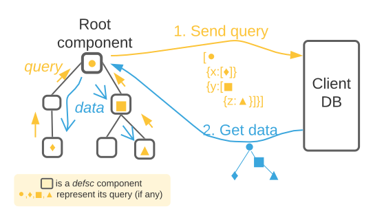

# A very brief introduction to Fulcro

Fulcro is a full-stack web framework for a _graph API_. What are the key parts?

* On the _frontend_ we have a **UI** tree composed of React _components_
* It talks to a **graph API** on the _backend_ to query for data and to effect _mutations_ (changes)
  * A single endpoint (x REST)
  * _Frontend describes_ what data it wants using EDN Query Language (EQL), _backend fills them in_, returning a data tree

Let's zoom in on the Frontend. I thas

* the UI component tree <-- props tree
* a normalized cache of data called "client DB"
* an asynchronous transaction subsystem ("Tx") for triggering mutations and data loads from the components

Let's see what happens the render the UI:

Keyword cloud:

* Component
* Component tree
* Data tree
* Mutation
* Transaction
* Client DB
* EQL
* Pathom
* Query
